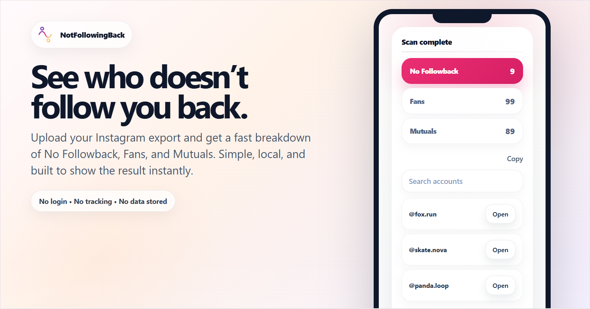

# NotFollowingBack

See who doesn’t follow you back on Instagram — private, fast, and no login required.

🔗 Live: **https://notfollowingback.app**

---

## Features

- Find users who don’t follow you back
- See mutual followers and fans
- Works with your Instagram data export
- 100% local processing (no upload)
- No login required
- Fast and mobile-friendly

---

## Privacy

Your data never leaves your device.

- No backend
- No account login
- No tracking
- No data storage

Everything runs locally in your browser.

---

## How it works

1. Request your data from Instagram  
2. Download the ZIP file  
3. Import it into the app  
4. Instantly see your follower breakdown  

Detailed instructions are available inside the app.

---

## Contact

Have questions, feedback, or suggestions?

- Open an issue on this repository  
- Or reach out directly: **hugolevacher13@gmail.com**

---

## Tech Stack

- React
- Vite
- TypeScript
- Tailwind CSS

---

## Disclaimer

This project is not affiliated with Instagram.

All data is provided by the user via their own export. The app does not interact with Instagram servers or APIs.

---

## Contributing

Contributions are welcome.

Feel free to open an issue or submit a pull request.

---

  

